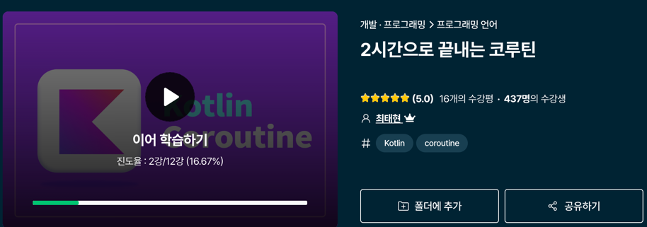

# kotlin-playground
코틀린에 대해 학습한 내용을 복습할 목적으로 한 연습 프로젝트

 

## 1. 아토믹 코틀린 정리

<image width=400 src="https://github.com/KoorunG/kotlin-playground/assets/83933192/7c7b430a-39a3-4026-8f87-248f2b1d83b6"></image>

[아토믹 코틀린](src/test/kotlin/com/koorung/kotlinplayground/atomickotlin/README.md)

 
 

## 2. 인프런 - 코틀린 고급편 강의내용 정리

<image width=400 alt="image" src="https://github.com/KoorunG/kotlin-playground/assets/83933192/d68636c2-a782-4e07-9d6e-12d051086115"></image>

[인프런 - 코틀린 고급편](src/test/kotlin/com/koorung/kotlinplayground/advancedkotlin/README.md)

 
 

## 3. 인프런 - 코틀린 코루틴 강의내용 정리

[인프런 - 코틀린 코루틴](src/test/kotlin/com/koorung/kotlinplayground/coroutine/README.md)